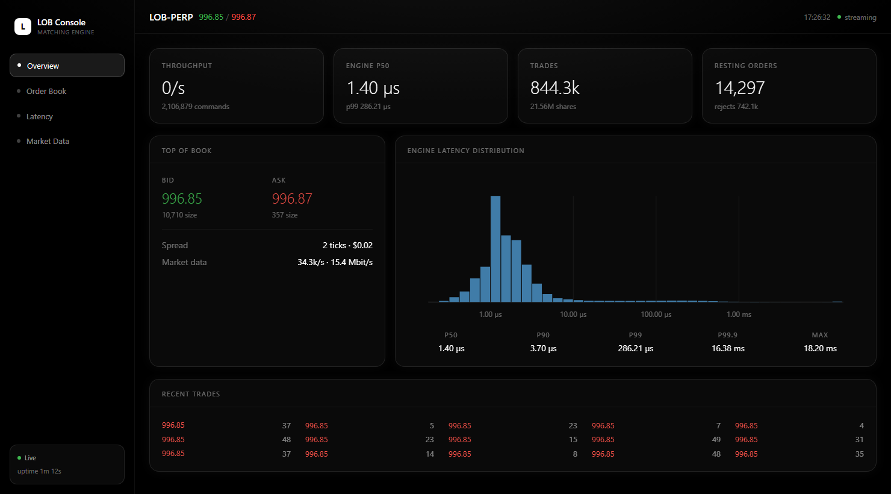
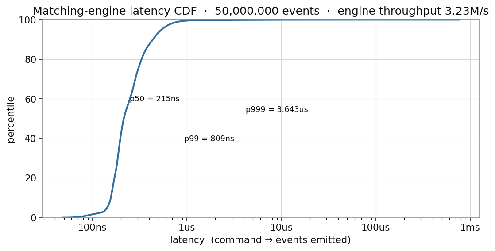
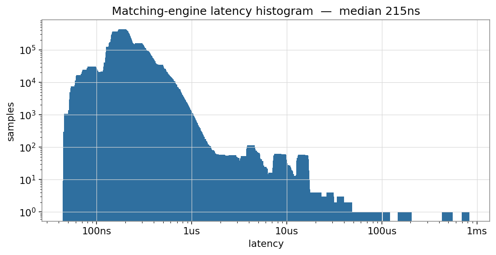
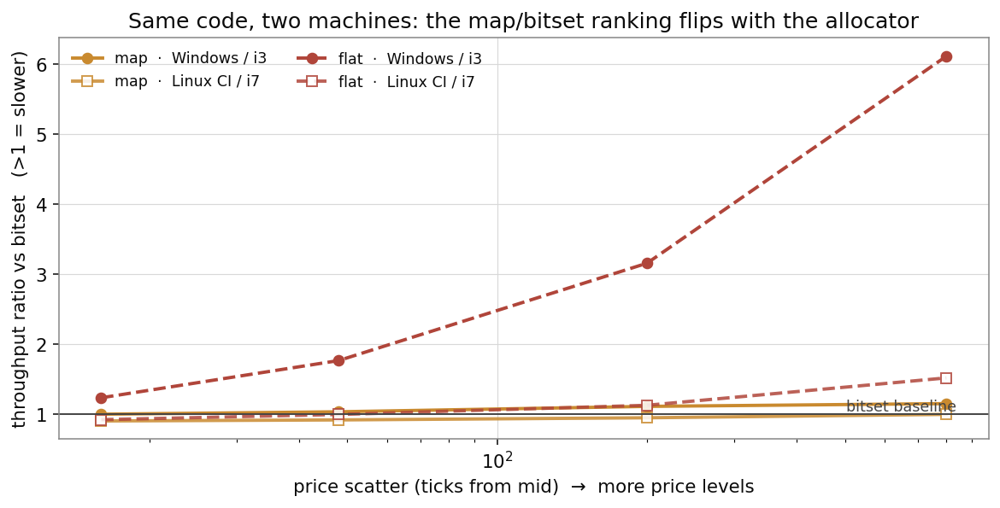
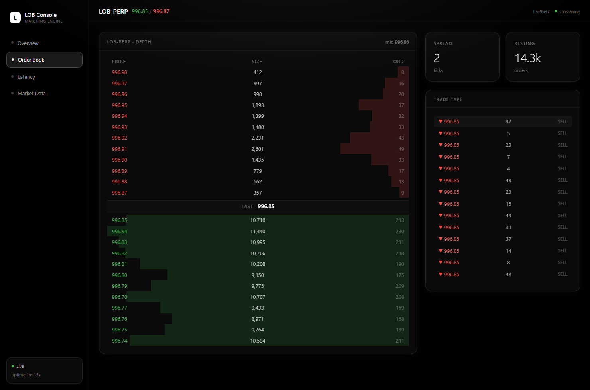
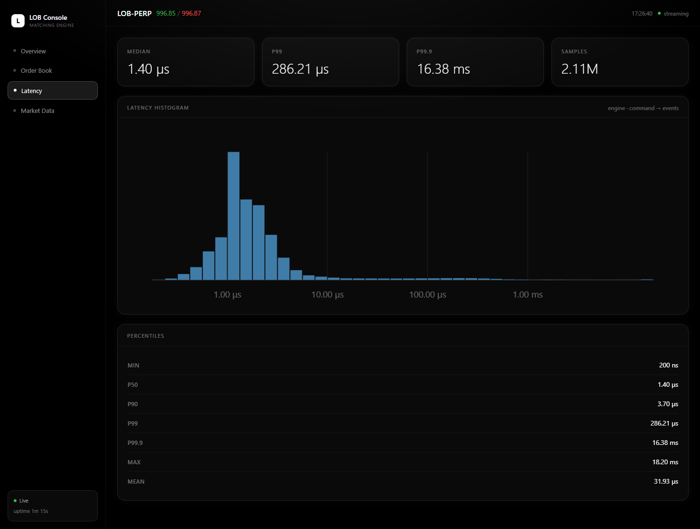
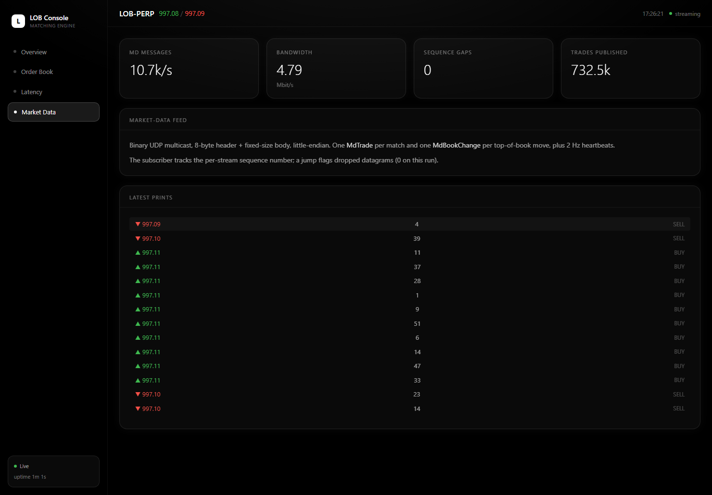

# Low-Latency Limit Order Book & Matching Engine

A price-time-priority matching engine and limit order book in **C++20**, with a
TCP order-entry gateway, a UDP multicast market-data feed, a deterministic
order-flow simulator, an HdrHistogram-based benchmark harness, and a live
operations dashboard.

The matching core runs at **~3.2 M orders/sec with a 215 ns median and 810 ns
p99** (command → all resulting events) on a passively-cooled laptop i3 — see
[measurement notes](#measurement-notes) and
[docs/benchmarks.md](docs/benchmarks.md) for the full methodology, run-to-run
variance, and the tuned-Linux reference target.



---

## What's in it

| | |
|---|---|
| **Matching engine** | price-time priority; Limit / Market / IOC / FOK / Post-Only; cancel; modify with correct queue-priority rules; self-trade prevention; price-band rejection |
| **Order book** | dense price array + two-level occupancy bitset → O(1) level lookup and hardware bit-scan best-bid/ask; intrusive FIFO per level; zero allocation on the hot path |
| **Networking** | RAII sockets over `epoll` (Linux) / `WSAPoll` (Windows); binary little-endian wire protocol; UDP multicast market data with sequence numbers |
| **Concurrency** | thread-per-stage pipeline (gateway ▸ engine ▸ publisher) wired by wait-free SPSC ring buffers; the engine is the single writer of the book, lock-free |
| **Measurement** | from-scratch HdrHistogram; `rdtsc` timing with probe-cost subtraction; deterministic replay |
| **Tooling** | `engine_server`, `md_simulator` (order-flow driver + feed subscriber), `lob_bench` (core + end-to-end) |
| **Dashboard** | single-file web console — depth ladder, trade tape, latency histogram, feed monitor |
| **Tests** | 44 GoogleTest cases: book invariants, price-time priority, order types, ring buffer under threads, hash map, histogram accuracy, wire round-trip, determinism |

Design rationale lives in [Architecture Decision Records](docs/adr/) and
[docs/architecture.md](docs/architecture.md).

---

## Build

Requires CMake ≥ 3.20, Ninja, and a C++20 compiler (GCC 12+, Clang 15+, or MSVC 19.3+).
GoogleTest is fetched automatically.

```bash
cmake -S . -B build -G Ninja -DCMAKE_BUILD_TYPE=Release
cmake --build build
ctest --test-dir build --output-on-failure
```

| CMake option | default | |
|---|---|---|
| `LOB_BUILD_TESTS` | ON | GoogleTest suite |
| `LOB_BUILD_APPS` | ON | `engine_server`, `md_simulator`, `lob_bench` |
| `LOB_NATIVE` | ON | `-march=native` |
| `LOB_ASAN` | OFF | AddressSanitizer + UBSan |
| `LOB_LTO` | OFF | link-time optimisation |

## Run it end to end

```bash
# 1. start the engine — TCP order entry :9001, UDP market data 239.7.7.7:9999,
#    dashboard snapshot every 250 ms
./build/engine_server --stats-file "$PWD/web/stats.json" --run-seconds 60

# 2. drive synthetic order flow and measure order-entry round-trip
./build/md_simulator --mode flow --rate 30000 --duration 45

# 3. (optional) watch the market-data feed
./build/md_simulator --mode subscribe

# 4. open the dashboard
python -m http.server 8777 --directory web    #  http://localhost:8777/
```

`tools/run_all.sh` (or `tools/run_all.ps1`) does build → test → benchmark →
live pipeline → charts in one shot.

## Benchmark

```bash
./build/lob_bench --mode core --events 50000000 --seed 1 --pin --cpu 3 \
    --json bench-out/core.json --csv bench-out/core_hist.csv
./build/lob_bench --mode e2e  --events 200000
python tools/plot_results.py       # -> docs/images/*.png
```

---

## Results

**Matching engine** — `lob_bench --mode core`, 50 M commands, single pinned thread.

| metric | value |
|---|---|
| throughput | **3.23 M commands / sec** (309 ns/cmd) |
| latency **p50** | **215 ns** |
| latency p90 | 438 ns |
| latency **p99** | **809 ns** |
| latency p99.9 | 3.6 µs |
| latency p99.99 | 14.6 µs |
| mean | 268 ns |
| trades executed | 20.6 M (0.77 fill ratio) |
| peak resting orders | ~50 k |





Across three seeds (20 M events each, brief cooldown between) the spread is
tight: **3.2–3.4 M cmd/s, p50 207–229 ns, p99 785–832 ns**. Best single
observed run was 3.65 M / 175 ns p50; sustained back-to-back 50 M runs with no
cooldown throttle this 15 W chip to ~2.5 M / ~300 ns p50. Percentiles through
p99.9 hold across all of it. Per-seed table and the tuned-Linux reference
target: **[docs/benchmarks.md](docs/benchmarks.md)**.

### Order-book structure comparison

The matching engine is `template <class Book>`, so the *same* logic runs
against the bitset book, a `std::map` baseline and a sorted-vector
(`flat_map`) baseline — all three verified to produce bit-identical output.
Sweeping book width and order-flow churn on **two machines** (Windows dev box,
Linux CI):



The `std::map` vs bitset ranking **flips between the two hosts** — it's an
allocator contest (Windows's heap punishes `std::map`'s node churn; glibc
doesn't), not an algorithm one, and cachegrind confirms the D1 miss-rate gap
is small (1.8 % vs 2.2 %). What holds on **both**: the sorted vector degrades
badly on a deep book (Windows 6×, Linux 1.5×, tens of µs p99.9), and the
bitset has the flattest tail across every configuration. It's the *safe*
choice, not the fastest. Full method, cross-platform results, cachegrind and
analysis: **[docs/study-order-book-structures.md](docs/study-order-book-structures.md)**
(reproduced by the `order-book study` GitHub Actions workflow).

---

## Dashboard

`web/index.html` — React + Tailwind (vendored, no build step), polls the
engine's `stats.json` once a second. Screenshots below are of the live
dashboard while `md_simulator` drives ~30k orders/sec into `engine_server`.

| Order Book — live depth ladder + trade tape | Latency — HdrHistogram + percentiles |
|---|---|
|  |  |

**Market Data** — UDP feed message rate, bandwidth and sequence-gap monitor:



---

## Repository layout

```
include/lob/        core library headers (engine, book, ring, wire, histogram, …)
src/                library implementation
apps/
  engine_server/    the running pipeline
  md_simulator/     order-flow driver + market-data subscriber
  bench/            latency & throughput benchmark
tests/              GoogleTest suite (44 cases)
tools/              benchmark runner, plotting, run-all scripts
web/                single-file operations dashboard
docs/
  adr/              10 architecture decision records
  architecture.md   data flow + component map
  benchmarks.md     methodology, results, reference target
  images/           generated charts + dashboard screenshots
.github/workflows/  CI: Linux (gcc + clang) & Windows, ctest, ASan/UBSan
```

---

## Measurement notes

Numbers here were measured on an **Intel Core i3-1125G4** (4c/8t, 2.0 GHz base,
15 W, passively cooled) running **Windows 11**, GCC 16.2 `-O3 -march=native`.

- The **core** benchmark times `MatchingEngine::process()` with a calibrated
  `rdtsc` delta, probe cost subtracted, 1 M-event warm-up, percentiles from an
  HdrHistogram — see [ADR 7](docs/adr/0007-latency-measurement.md).
- p50–p99.9 are the engine. The far tail (one 1–70 ms outlier per run) is the
  OS preempting the benchmark thread on a shared, non-isolated machine; it is
  reported as-measured, not filtered.
- The **end-to-end** wire round-trip on this box is dominated by Windows
  loopback TCP (~15 µs floor) and by co-scheduling the pipeline threads on 4
  cores. It validates the framing / routing / multicast paths under load (zero
  dropped commands, zero market-data sequence gaps) but is not a latency
  result for the design — [docs/benchmarks.md](docs/benchmarks.md#reference-target--tuned-bare-metal-linux)
  explains the gap to a tuned Linux host.

## License

MIT — see [LICENSE](LICENSE).
