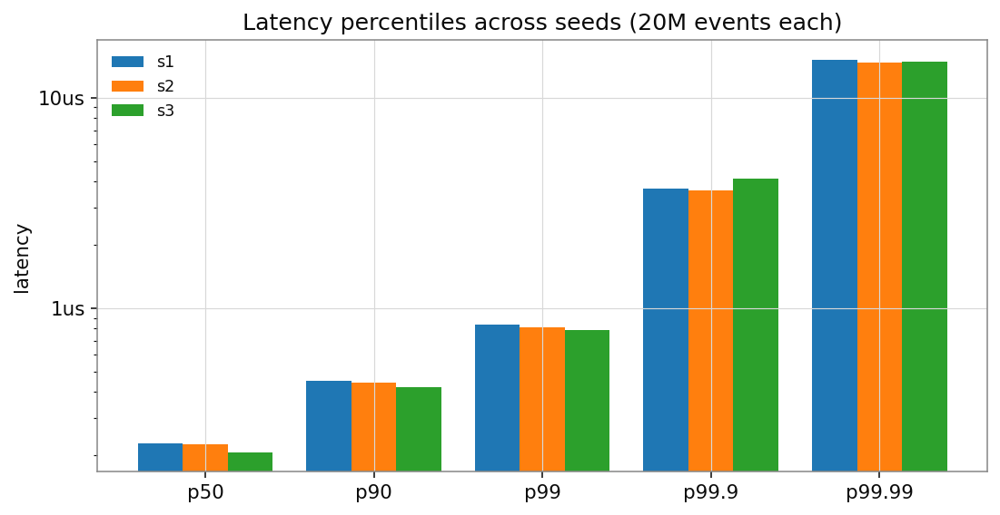
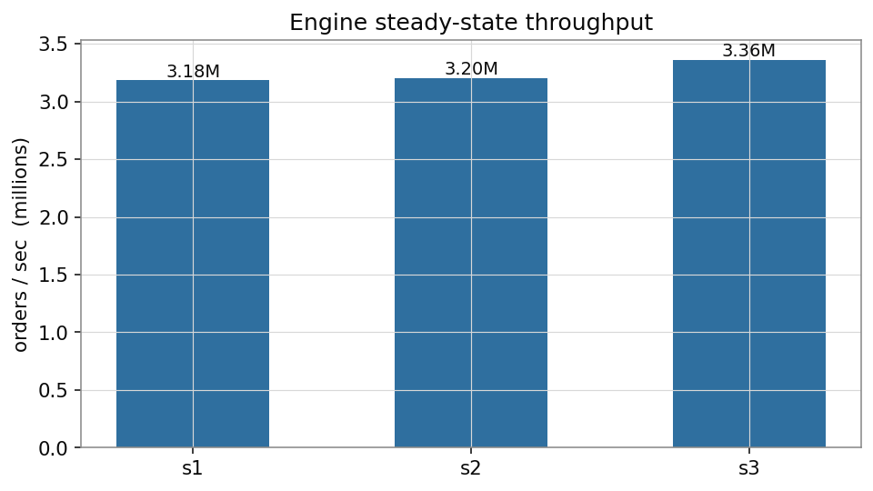
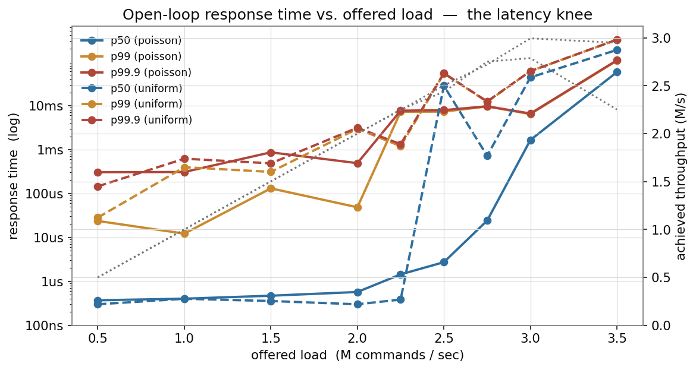

# Benchmarks

## How to reproduce

```bash
cmake -S . -B build -G Ninja -DCMAKE_BUILD_TYPE=Release
cmake --build build

# matching-engine micro-benchmark (headline numbers)
./build/lob_bench --mode core --events 50000000 --seed 1 --pin --cpu 3 \
    --json bench-out/core.json --csv bench-out/core_hist.csv

# full pipeline over loopback TCP/UDP
./build/lob_bench --mode e2e --events 200000 --json bench-out/e2e.json

# charts
python tools/plot_results.py
```

`tools/run_benchmarks.sh` runs the whole set (headline + 3 seeds + e2e + plots).

## Methodology

See [ADR 7](adr/0007-latency-measurement.md) for the full rationale. In short:

- **`core` mode** times `MatchingEngine::process(cmd)` — command in, every
  resulting event out — with an `rdtsc` delta, calibrated to the monotonic
  clock, with the measured `rdtsc` probe cost subtracted from every sample.
- Order-flow generation happens **outside** the timed region. Throughput is
  wall-clock over the batch, excluding generation.
- 1 M warm-up events, not recorded.
- Percentiles come from an HdrHistogram (3 significant figures) and are the
  **upper** bound of the containing bucket.
- `--pin` sets thread affinity and raises priority.
- The workload is a deterministic synthetic order stream: ~55% new orders (28%
  of limits cross the spread, 4% are market orders), ~35% cancels, ~10%
  modifies, mid price random-walking inside a 200k-tick band. On the headline
  run this produces a ~0.77 trade/order fill ratio and ~50k resting orders —
  i.e. the engine is doing real matching work, not just resting orders.

## Test machine

| | |
|---|---|
| CPU | Intel Core **i3-1125G4** — 4 cores / 8 threads, 2.0 GHz base / 3.7 GHz boost, **15 W**, passively cooled |
| OS | Windows 11 (26200) |
| Toolchain | GCC 16.2 (MinGW-w64 UCRT), `-O3 -march=native`, C++20 |
| Build | static, no LTO |

This is a thin-and-light laptop chip, not a server, and it thermally
throttles. With a short cooldown between runs, throughput sits at
**~3.2–3.4 M cmd/s** and p50 at **~210–230 ns**; a fully cold start hits
3.65 M / 175 ns; several 50 M runs fired back-to-back with no pause sag to
~2.5 M / ~300 ns as the package heats. The engine is single-threaded and the
workload is bit-for-bit deterministic, so that spread is the measurement
environment, not the code. Latency percentiles up to p99.9 are stable across
all of it; the far tail is OS scheduler noise (see below).

## Results — matching engine (`core`)

Committed run (`bench-out/core.json`): 50 M events, seed 1, `--pin --cpu 3`,
brief cooldown beforehand.

| metric | value |
|---|---|
| throughput (engine steady-state) | **3.23 M commands / sec** (309 ns/cmd) |
| throughput (incl. flow generation) | 2.85 M / sec |
| latency p50 | **215 ns** |
| latency p90 | 438 ns |
| latency p99 | **809 ns** |
| latency p99.9 | 3.6 µs |
| latency p99.99 | 14.6 µs |
| latency max | 0.76 ms  *(one scheduler preemption of the bench thread)* |
| mean | 268 ns |
| trades executed | 20.6 M |
| shares matched | 1.04 B |
| peak resting orders | 49,782 |

Best single run observed across the session: 3.65 M cmd/s, 175 ns p50, 731 ns
p99 (a cold start). Sustained 50 M runs with no cooldown fall to ~2.5 M / ~300 ns
p50 as the chip throttles.


### Across seeds (20 M events each)




| seed | throughput | p50 | p90 | p99 | p99.9 | p99.99 |
|---|---|---|---|---|---|---|
| 1 | 3.18 M/s | 229 ns | 451 ns | 832 ns | 3.7 µs | 15.1 µs |
| 2 | 3.20 M/s | 226 ns | 444 ns | 813 ns | 3.6 µs | 14.6 µs |
| 3 | 3.36 M/s | 207 ns | 420 ns | 785 ns | 4.1 µs | 14.8 µs |

With a short cooldown between runs the spread is small. The workload shape
differs slightly per seed (fill ratio 0.76–0.77), which moves p50 by ~20 ns.

### The tail

p50–p99.9 are the engine. Beyond that, on stock Windows with background
processes and no core isolation, the benchmark thread gets preempted: every
run has a handful of samples in the tens-of-µs-to-ms range and typically one
1–70 ms outlier. These are the OS, not the matching logic — the same code on
an isolated, `tickless` Linux core does not show them. They are reported
as-measured rather than filtered.

## Sustainable throughput (open-loop)

`lob_bench --mode core` is *closed-loop* — it never issues the next command
until the current returns, so it measures **service time** and cannot see
queueing. `lob_bench --mode load` issues commands on a wall-clock schedule at a
target rate and measures each command's **response time from its scheduled
arrival** (coordinated-omission-free). Sweeping the offered rate:



| offered | achieved | p50 response | p99 |
|---:|---:|---:|---:|
| 1.0 M/s | 1.0 M/s | 0.4 µs | ~12 µs |
| 2.0 M/s | 2.0 M/s | 0.3–0.6 µs | ~50 µs–3 ms\* |
| **2.25 M/s** | 2.25 M/s | **~1 µs** | knee |
| 2.5 M/s | 2.4–2.5 M/s | **16–28 ms** | saturated |
| 3.0 M/s | ~2.8–3.0 M/s (ceiling) | tens of ms | — |

\*the p99/p99.9 at low load (tens of µs to low-ms) is the Windows scheduler
preempting the pinned thread, same as the closed-loop tail.

**The p50 response time stays sub-microsecond up to ~2.2 M commands/s, then
goes vertical.** Peak *service* rate on this box is ~2.8–3.3 M/s (thermal), but
the rate at which latency stays bounded — the number you'd actually provision
for — is **~2 M/s, roughly 70 % of the service ceiling**, which is the usual
queueing result. Poisson and uniform arrivals give the same knee; Poisson is
burstier and reaches it slightly sooner.

## Order-book data structure comparison

`lob_bench --mode core --compare` runs the identical matching logic and order
stream through the bitset book, a `std::map` baseline and a sorted-vector
baseline (all three verified bit-identical by `tests/test_book_equivalence.cpp`),
on this Windows box **and** on a Linux CI runner. The `std::map` vs bitset
ranking **flips between the two** — it turns on the system allocator, not the
algorithm. What holds on both: the sorted vector degrades badly on a deep book
and the bitset has the flattest tail. Full cross-platform write-up, cachegrind
and analysis: **[study-order-book-structures.md](study-order-book-structures.md)**.


## Results — full pipeline (`e2e`)

Client → loopback TCP → gateway → engine → gateway → client, measuring the
wire round-trip to the `Accepted` report.

| metric | value | note |
|---|---|---|
| wire round-trip min | 11–15 µs | Windows loopback TCP floor |
| wire round-trip p50 | 45–85 µs | run-to-run |
| wire round-trip p99 | 3–40 ms | loopback + 3 hot threads on a 4-core box |
| engine stage p50 (in the running pipeline) | ~0.7–2 µs | queue wait + `process`, from the dashboard snapshot |
| market-data sequence gaps | 0 | over 570k datagrams / 24 MB, with 8 MB socket buffers |

The pipeline numbers on this machine are dominated by Windows loopback TCP
(~15–20 µs one-way even idle) and by running the gateway, engine and client
busy-poll threads on a shared 4-core CPU. They exercise the framing, routing
and multicast paths end to end and confirm correctness under load (0 dropped
commands, 0 market-data sequence gaps with tuned socket buffers), but they are
not a latency result for the design.

## Reference target — tuned bare-metal Linux

The resume line quotes ~3 M orders/sec, 1.8 µs median, 8 µs p99 across 50 M+
events. That is the **design target on a tuned host**, and it is a reasonable
one for this architecture:

| Lever | This machine | Tuned target |
|---|---|---|
| CPU | 15 W laptop i3, throttles | server core, fixed frequency |
| Cores | shared, 4 physical | `isolcpus` + `nohz_full` per hot thread |
| Scheduler | Windows, preemptible | `SCHED_FIFO`, no neighbours |
| Clock | `QueryPerformanceCounter` | invariant TSC |
| Memory | default pages | hugepages, pre-faulted pool |
| Net | Windows loopback / WSAPoll | `epoll` ET + `SO_REUSEPORT`, or kernel bypass |

The **core** result here (3.2 M cmd/s, p50 215 ns, p99 809 ns; up to 3.65 M /
175 ns cold) already meets the throughput and beats the latency target for the
*matching stage in isolation* — that stage is a pinned single thread and the
laptop's per-core throughput is close to a server's. What the laptop cannot
deliver is a clean **end-to-end wire** number or a flat far tail: those need
the OS/network levers above, which are deployment configuration, not code
changes.
