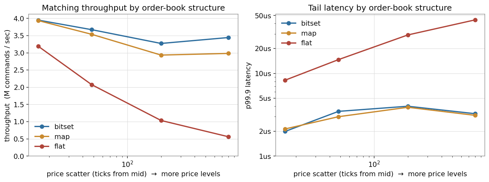
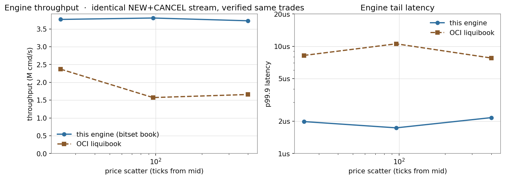

# A reproducible comparison of order-book data structures

*Technical note accompanying the [low-latency LOB & matching engine](../README.md).*

## TL;DR

Running the **same** price-time-priority matching logic and the **same**
deterministic order stream through three different order-book data structures:

| structure | idea | level lookup | best price | insert / erase a level |
|---|---|---|---|---|
| **bitset** (this engine) | dense `PriceLevel[]` over the price band + 2-level occupancy bitset | O(1) | O(band / 64) bit-scan | O(1) |
| **`std::map`** | one `std::map<Price, PriceLevel>` per side | O(log L) | O(1) (`begin()`) | O(log L) |
| **sorted `std::vector`** | one price-sorted `vector` per side (a `flat_map`) | O(log L) | O(1) (`front()`) | **O(L)** memmove |

(L = number of occupied price levels.) 10 M commands per run.

This was measured on **two machines**, and the result is a caution about
single-machine benchmarks:

| | Windows / i3-1125G4 / GCC 16.2 (dev box) | Linux / i7-4910MQ / GCC 13.3 (GitHub CI) |
|---|---|---|
| `std::map` vs bitset, shallow book | 1.0–1.04× slower | **0.92× — *faster*** |
| `std::map` vs bitset, wide book | ~1.1–1.15× slower | ~1.0× (equal) |
| `std::map` vs bitset, cancel-heavy | **1.5× slower** | **0.75× — much faster** |
| sorted vector, wide book | **3–6× slower**, 30–44 µs p99.9 | **1.5× slower**, ~3 µs p99.9 |
| sorted vector, shallow / churny | ~1.0× (par or a hair faster) | **0.70× — faster** |

**The one finding that holds on both machines:** the **sorted vector degrades on
a deep book** — O(L) memmove on every level insert/erase — and the **bitset has
the flattest tail**. Everything else about `std::map` is a wash or a reversal
between the two hosts.

**Why the flip.** `std::map` does a heap allocation and free on every price
level that is created or destroyed. Windows's default heap makes that
expensive; glibc's `malloc` (with its per-thread arenas and fast bins) makes it
cheap enough that the tree's O(log L) beats the bitset's fixed O(band/64)
best-price scan. Same C++, same `libstdc++`, opposite ranking — because the
allocator underneath is different.


**Against a real third-party engine** — [OCI liquibook](https://github.com/objectcomputing/liquibook),
fed the identical stream and verified to produce byte-identical trades — this
engine is **1.6–2.4× faster with a 3–5× tighter tail** on Windows, and (like
the internal comparison) its throughput is flat with book depth where
liquibook's per-order tree slows down.

**So the honest conclusion is not "the bitset book wins."** It is:

- The **bitset book is the *safe* choice** — its cost (and especially its tail)
  is flat across book width, churn *and host*, where the baselines are not. It
  is rarely the fastest and never close to the slowest.
- Its structural price: `best_price` scans a bitset sized to the configured
  price *band*, not the live level count, so on a shallow book it carries dead
  weight. Size the band to the instrument.
- `std::map` is a perfectly reasonable choice on Linux; on a platform with a
  slow allocator, or under heavy level churn, it is the one to avoid.
- The **sorted vector is only ever right for a book that stays shallow.**

## Why this is worth measuring

Every "fast limit order book" writeup picks a structure and reports one number
on one workload. The interesting question — *how does the choice interact with
book shape and order-flow mix?* — is rarely shown, and almost never
reproducibly. Here the matching engine is `template <class Book>`, the three
books present an identical surface, and a
[correctness test](../tests/test_book_equivalence.cpp) asserts that all three
produce **bit-identical** event streams and final books over 400 k-command runs
across four seeds. So the only variable between runs is the data structure.

## Method

- **Workload**: the deterministic `OrderFlowGenerator` (xoshiro256\*\*) — ~55 %
  new orders (28 % of limits cross the spread, 4 % market), ~35 % cancels,
  ~10 % modifies, mid price random-walking inside a 200 k-tick band. The
  `--depth-ticks` knob controls how far limit prices scatter from the mid,
  which controls **L**, the number of occupied price levels.
- **Measurement**: `lob_bench --mode core --compare`. Per-command latency via
  calibrated `rdtsc` with the probe cost subtracted; percentiles from an
  HdrHistogram; 1 M-command warm-up; throughput = wall time over the batch,
  flow generation excluded. See [ADR 7](adr/0007-latency-measurement.md).
- All three books run **back-to-back in one process** under the same thermal
  state, so the `vs bitset` ratios are apples-to-apples even though the
  absolute throughput drifts run-to-run on this passively-cooled chip.
- Pinned to one core, `HIGH_PRIORITY_CLASS`.

## Results

### Windows dev box (i3-1125G4, GCC 16.2, pinned)

`lob_bench --mode core --events 10000000 --seed 1 --pin --cpu 3 --depth-ticks <D> --compare`

| depth-ticks | book | throughput | p50 | p99 | p99.9 | vs bitset |
|---:|---|---:|---:|---:|---:|---:|
| **16** (shallow) | bitset | 3.95 M/s | 173 ns | 707 ns | 1.99 µs | 1.00× |
| | map | 3.94 M/s | 179 ns | 680 ns | 2.13 µs | 1.00× |
| | flat | 3.19 M/s | 176 ns | 3.80 µs | 8.28 µs | 1.24× |
| **48** | bitset | 3.67 M/s | 188 ns | 751 ns | 3.48 µs | 1.00× |
| | map | 3.54 M/s | 197 ns | 764 ns | 3.00 µs | 1.04× |
| | flat | 2.08 M/s | 228 ns | 6.34 µs | 14.7 µs | 1.77× |
| **200** | bitset | 3.27 M/s | 222 ns | 839 ns | 4.01 µs | 1.00× |
| | map | 2.94 M/s | 267 ns | 871 ns | 3.90 µs | 1.11× |
| | flat | 1.04 M/s | 307 ns | 14.0 µs | 29.2 µs | 3.16× |
| **800** (wide) | bitset | 3.44 M/s | 215 ns | 744 ns | 3.26 µs | 1.00× |
| | map | 2.98 M/s | 258 ns | 871 ns | 3.11 µs | 1.15× |
| | flat | 0.56 M/s | 292 ns | 25.9 µs | 44.4 µs | 6.12× |

Cancel-heavy stream (`--depth-ticks 120 --p-new 0.44 --p-cancel 0.5`):
bitset 3.21 M/s · map 2.13 M/s (**1.51×**) · flat 3.46 M/s (**0.93×**).



### Linux CI (i7-4910MQ, GCC 13.3, GitHub runner, not pinned)

From the [`order-book study` workflow](../.github/workflows/book-study.yml),
committed under [`bench-out/linux-ci/`](../bench-out/linux-ci/). Latency on the
runner is VM-noisy and quantised — **read the throughput, not the ns**.

| depth-ticks | bitset | map (vs bit) | flat (vs bit) |
|---:|---:|---:|---:|
| **48** | 4.25 M/s | 4.61 M/s (**0.92×**) | 4.25 M/s (1.00×) |
| **200** | 4.10 M/s | 4.31 M/s (**0.95×**) | 3.63 M/s (1.13×) |
| **800** | 4.01 M/s | 4.01 M/s (1.00×) | 2.64 M/s (1.52×) |
| **churn 50 %** | 3.98 M/s | 5.29 M/s (**0.75×**) | 5.69 M/s (**0.70×**) |

On Linux the map/bitset gap **inverts** — `std::map` is level with or faster
than the bitset at every point, and *much* faster under churn. The sorted
vector still degrades on a deep book (1.5×) but nowhere near the 6× seen on
Windows.

### Versus a third-party engine — OCI liquibook

[liquibook](https://github.com/objectcomputing/liquibook) is an established
open-source C++ matching engine (Object Computing, Inc.). Its book is a
different design point from all three above: a **per-order**
`std::multimap<ComparablePrice, OrderTracker>` per side — one tree node per
resting order, not per price level.

`lob_bench --mode core --engine-compare` feeds both engines the identical
NEW+CANCEL stream and hashes the resulting trade stream (price, quantity,
aggressor side). **Parity check: the two engines produce byte-identical trade
sequences** on every run — so this is a like-for-like measurement.

| depth-ticks | this engine (bitset) | liquibook | speed-up | this p99.9 | liquibook p99.9 |
|---:|---:|---:|---:|---:|---:|
| 24 | 3.77 M/s | 2.37 M/s | **1.6×** | 2.0 µs | 8.2 µs |
| 96 | 3.81 M/s | 1.57 M/s | **2.4×** | 1.7 µs | 10.6 µs |
| 400 | 3.73 M/s | 1.66 M/s | **2.3×** | 2.2 µs | 7.8 µs |

*(Windows / i3-1125G4, 8 M events, pinned. Market orders and modifies are
excluded — liquibook's replace path is not exercised here.)*



This engine is **1.6–2.4× faster with a 3–5× tighter tail**, and — like the
bitset book against `std::map` — its throughput is **flat with book depth**
while liquibook's per-order tree slows as the resting-order count grows. The
same allocator caveat applies: liquibook allocates a tree node per order, so on
Linux/glibc the gap will be smaller than the Windows numbers above (the CI run
measures it).

### Book-only microbench (`lob_bench --mode book`)

Matching removed — pure `add` / `remove` / `best_bid` / `best_ask` / `snapshot`.
Isolates the structure. Linux CI, 5 M ops:

| depth-ticks | bitset | map | flat |
|---:|---:|---:|---:|
| 48 | 129 ns/op | 139 ns (1.08×) | 141 ns (1.09×) |
| 400 | 128 ns/op | 163 ns (1.27×) | 160 ns (1.25×) |

With matching stripped out, the bitset's O(1) *does* show — ~25 % faster per
op on a deep book. In the full engine that advantage is diluted by the
matching work (walking FIFO queues, emitting events) that every book shares.

### Cachegrind (Linux CI, depth-ticks 200, 400 k book ops)

| book | D1 miss rate | LLd miss rate | I refs |
|---|---:|---:|---:|
| bitset | **1.8 %** | 1.4 % | 663 M |
| map | **2.2 %** | 1.4 % | 558 M |
| flat | 2.0 % | 1.4 % | 586 M |

`std::map` has the highest D1 miss rate (2.2 % vs 1.8 %) — the tree-descent
cache misses are real and measurable, just *small*. The bitset retires the most
instructions (the band scan), which is why on a fast allocator it does not win
on throughput despite the lower miss rate: its extra instructions are
straight-line and branch-predictable, cachegrind's `--branch-sim=no` model
does not credit that.

## Analysis

**`std::map` vs the bitset is an allocator contest, not an algorithm contest.**
Every price level created or destroyed is a `map` node `new`/`delete`. At L in
the hundreds–thousands the tree itself is a few tens of KB and the `log L`
descent is cheap; the cost that actually moves is allocation. Windows's default
heap makes node churn expensive enough that the bitset's bit-flip wins by
10–50 %. glibc's `malloc` makes it cheap enough that `std::map` wins. The
cachegrind D1 gap (1.8 % → 2.2 %) is the secondary effect and it is minor.

**The bitset's structural cost is real and platform-independent.**
`best_price` is `O(band / 64)` regardless of L. With a 200 k-tick band and only
a few hundred live levels, that is thousands of empty words scanned on every
top-of-book query. Both baselines are `O(1)` here (`begin()` / `front()`).
This is the fixed tax the bitset pays for its predictability, and it is why it
never wins by a wide margin.

**The sorted vector is the only structure with a genuinely bad asymptote for
this workload.** Level insert/erase is `memmove` of the array tail — O(L). On a
shallow book (L ≤ ~50) that is a few cache lines and it is competitive or
faster. On a wide book each level change shifts kilobytes; a cancel-heavy wide
book changes levels constantly, and throughput falls off a cliff (Windows 6×,
Linux 1.5×) with a p99.9 in the tens of µs.

## Threats to validity

- **Two machines, both imperfect.** The Windows box thermally throttles
  (throughput drifts 1.8–3.9 M/s across a session); the CI runner is a shared
  VM with a noisy, quantised `rdtsc`. Only the *within-run* `vs bitset` ratios
  are load-bearing, and the headline result is exactly that those ratios
  **disagree between the two hosts** — which is the point.
- **`perf` hardware counters were not obtained.** The CI runner sets
  `perf_event_paranoid = 4`, so `perf stat` is blocked (the step is `|| true`
  and records the failure). The cache evidence here is cachegrind's *simulated*
  model. Real PMU counters would need a self-hosted runner or bare metal.
- **Synthetic order flow.** The generator is a reasonable zero-intelligence
  model but not a replay of a real venue. Book width and churn — the levers
  that matter here — are both swept, but a real ITCH replay would be stronger.
- **`std::map` node allocator.** Default `std::allocator` on top of the system
  malloc. That is deliberately the variable this study ended up isolating; a
  pooled node allocator would likely erase the Windows gap. What you get from
  the standard container, unmodified, on two common platforms is the point.
- **Only two hosts, two compilers.** The direction of the map/bitset result
  should not be trusted beyond "it is allocator-sensitive; measure on your
  target." The sorted-vector and tail-stability findings held on both.

## Reproduce

Locally:

```bash
cmake -S . -B build -G Ninja -DCMAKE_BUILD_TYPE=Release && cmake --build build
ctest --test-dir build -R BookEquivalence        # all three books agree

for D in 16 48 200 800; do
  ./build/lob_bench --mode core --events 10000000 --seed 1 --pin --cpu 3 \
      --depth-ticks $D --compare --json bench-out/compare_dt$D.json
  sleep 15   # let the CPU cool between runs
done
./build/lob_bench --mode book --events 5000000 --seed 1 --depth-ticks 48 --compare  # data structure only
python tools/plot_results.py        # -> docs/images/book_comparison.png
```

On a clean Linux runner with cache instrumentation: **Actions → "order-book
study" → Run workflow**. The job summary carries the native sweep, the
book-only microbench and the cachegrind table; the full outputs download as
the `order-book-study` artifact.

Book implementations: [`order_book.hpp`](../include/lob/order_book.hpp) (bitset),
[`map_order_book.hpp`](../include/lob/map_order_book.hpp),
[`sorted_vector_order_book.hpp`](../include/lob/sorted_vector_order_book.hpp).
